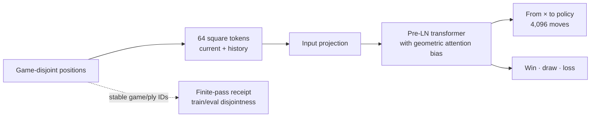

# Chess Transformer


[](https://crates.io/crates/axis)


A Rust + [Axis](https://github.com/furkanhaney/axis) migration of the
Chessformer human-move experiment. The model reads a chess position as 64
square tokens and jointly learns the move a person played and the eventual
game outcome from the moving side's perspective.



## What runs today

The repository contains a bounded, inspectable acceptance experiment over
eight legal opening lines. Six games train the model and two whole games are
reserved for evaluation before positions are derived. The smoke exercises:

- 64 square tokens with current position plus history;
- vertical mirroring and color normalization when Black moves;
- bidirectional multi-head attention;
- input-dependent geometric attention bias with shared square-pair templates;
- a bilinear 4,096-class source-to-destination policy head;
- a three-class side-to-move value head;
- joint `policy + 0.1 × value` cross-entropy with AdamW; and
- exact finite-pass and train/evaluation-disjoint receipts from Axis.

```bash
python3 scripts/setup_cuda.py   # once, if CUDA 13.2 is not already available
bash scripts/check.sh
bash scripts/train.sh --smoke
```

The setup helper hash-verifies NVIDIA's archives and materializes their six
linker aliases as independent regular files. Re-running it checks and repairs
those copies even when every package marker is already present.

The included corpus is deliberately too small to measure chess ability. Its
job is to prove the architecture, gradients, optimizer, representation, and
data contracts together on a real GPU path.

## Historical result, with its boundary

The strongest completed Python run (`research/chessformer/runs/run_009_value`)
trained a 5.08M-parameter model for one epoch over 783,251 positions from
100,000 Lichess games. Its log reports 59.01% policy accuracy and 52.88% value
accuracy. Those are training-subset diagnostics: the Python validation loader
randomly selected positions from the same dataset used for training. They are
not independent holdout results and are not reproduced here.

The earlier 26.90% figure came from a smaller 4,984-game run and likewise used
the old evaluation recipe. Neither number is comparable to the paper's ALLIE
benchmark.

## Next experiment

The next publishable run should ingest the paper-aligned Lichess recipe: blitz
games from 2023-01 through 2025-07, time-pressure filtering, Elo-bin balancing,
32 sampled positions per game, and a versioned game-level split. Promotion
piece supervision and Elo conditioning remain outside this first Axis path;
the migration contract records the exact preserved and deferred pieces.

See [the migration contract](docs/migration.md) for the source map and claim
boundaries. The exact first-run environment and receipt are in
[the Axis acceptance witness](docs/acceptance.md).
